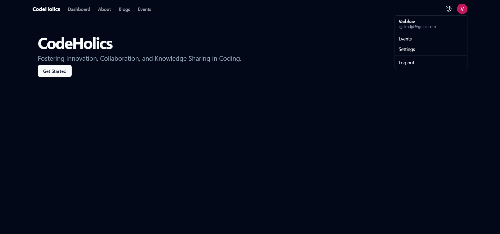
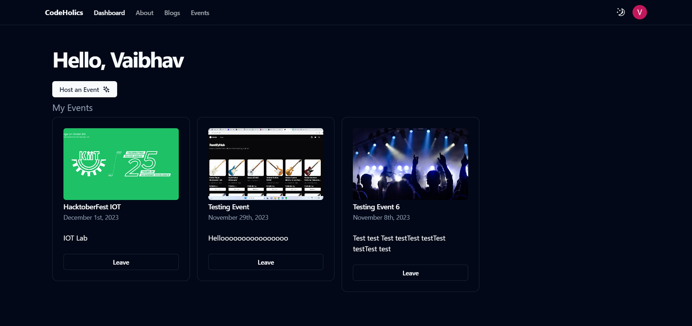
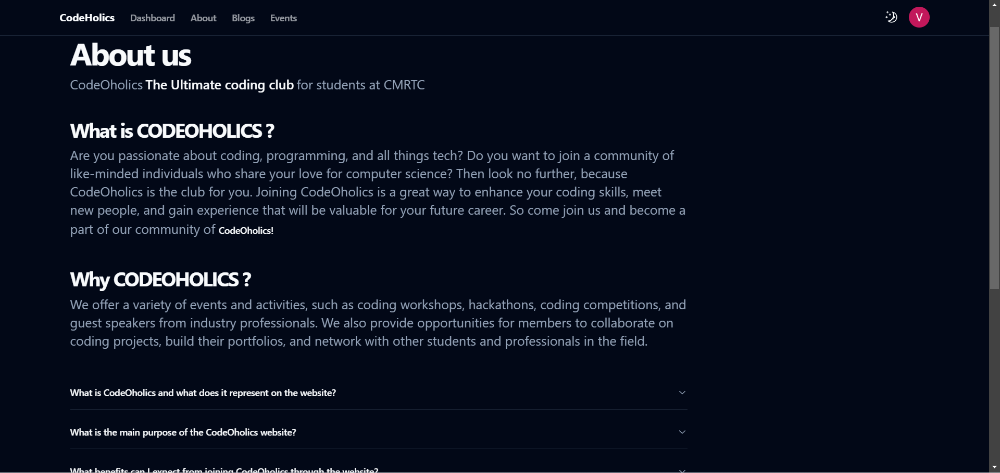
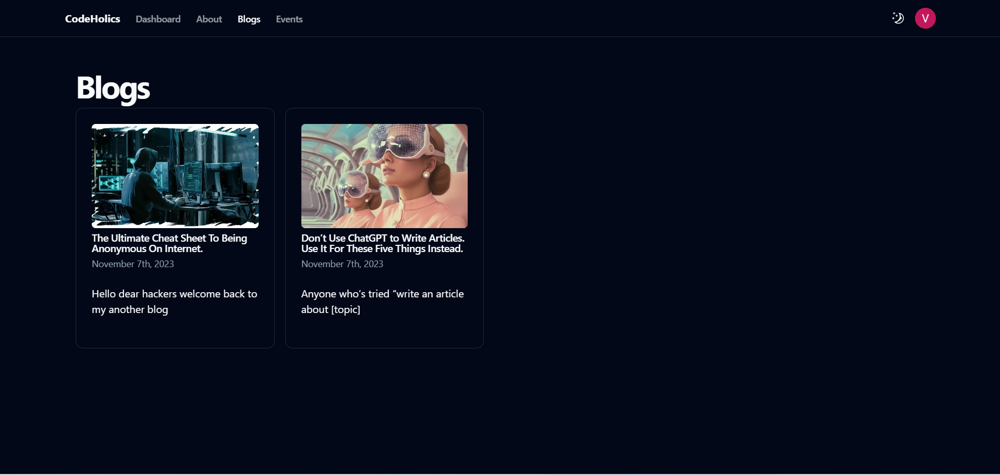
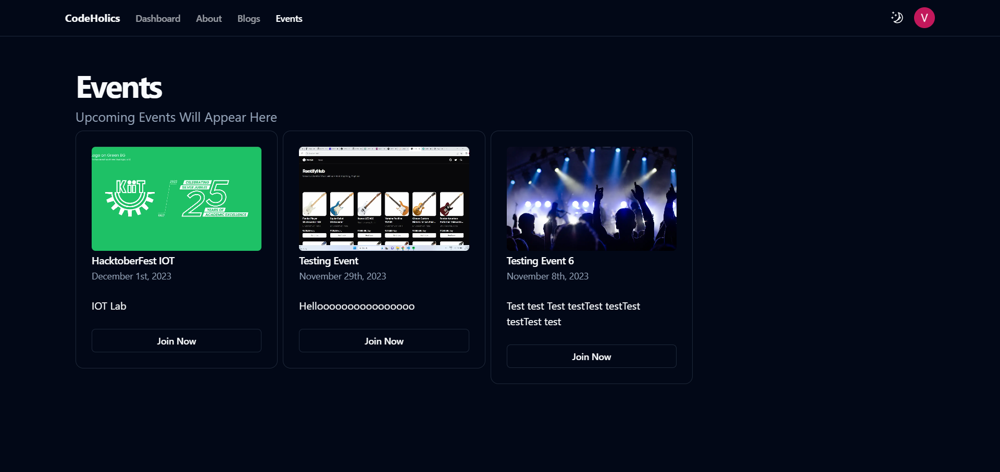
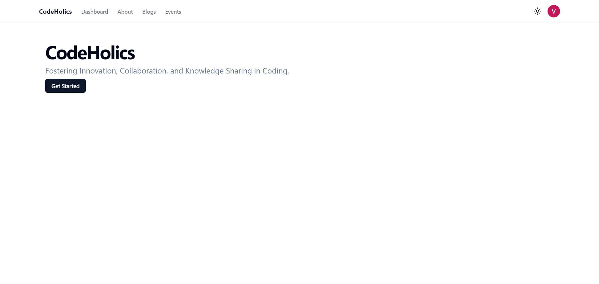
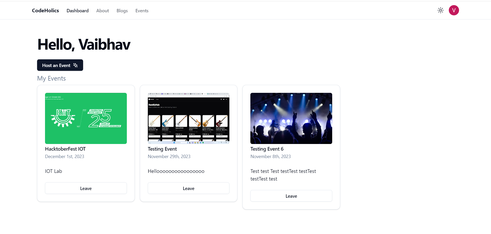
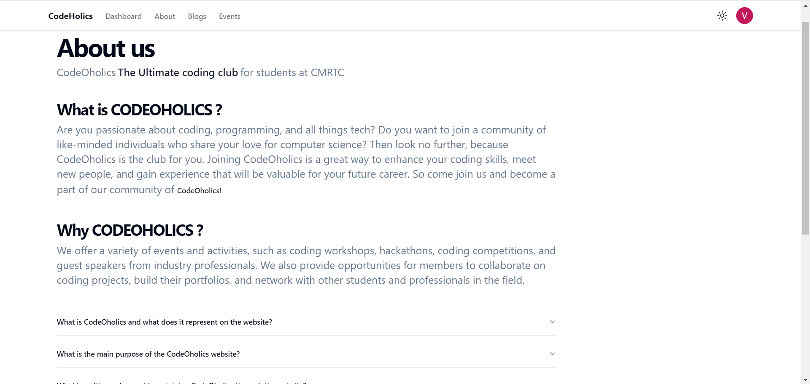
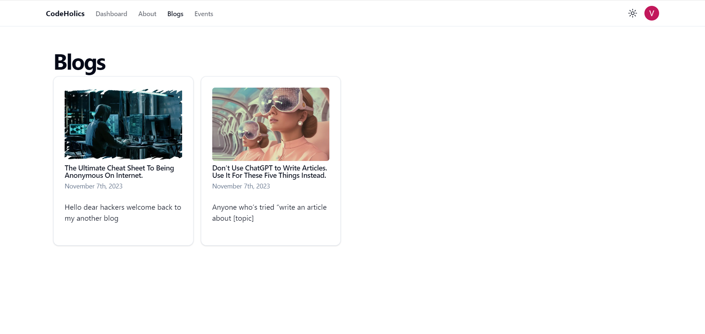
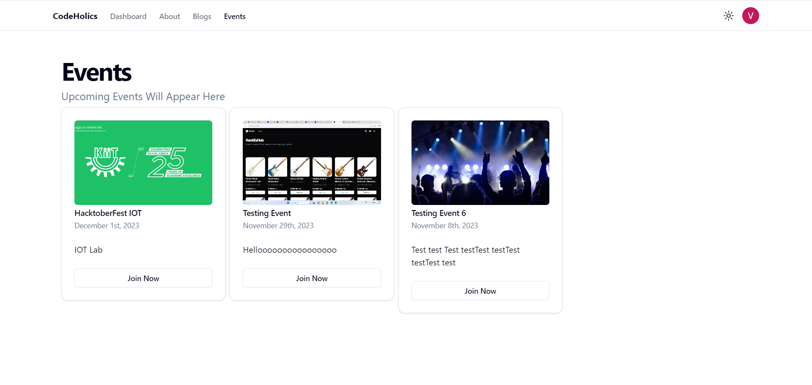

# CodeOholics Hack-4-Mini

Hack-4-Mini is the ultimate Inter-College Online Coding Contest

## Description

This is the frontend of the CodeOholics portal. It is built using NextJS, shadcn/ui and TailwindCSS. The backend lies in another [repository](https://github.com/solo8116/CodeOHolicsBackend).

## Images
### Dark Mode

### Light Mode

## Contributing

Contributions are welcome!

## Contact

If you want to contact me you can reach me at

- [Instagram](https://www.instagram.com/dead8309_/)
- [Discord](https://discordapp.com/users/888890990956511263)
